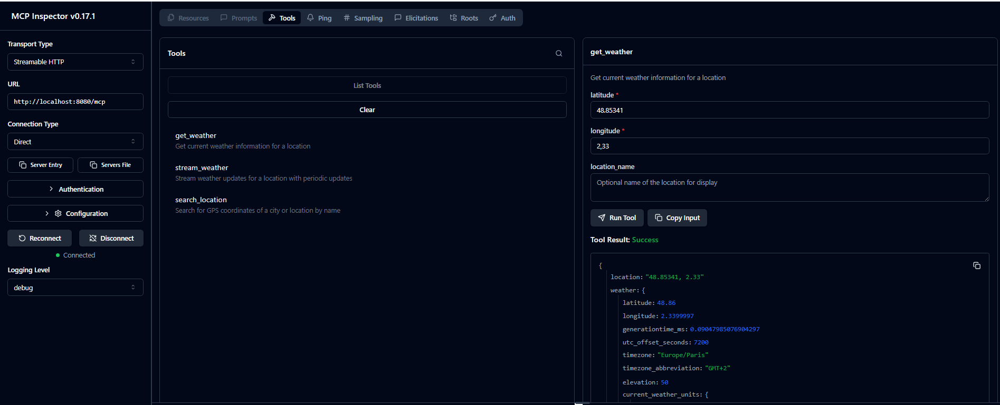
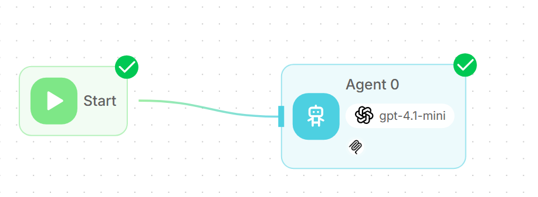
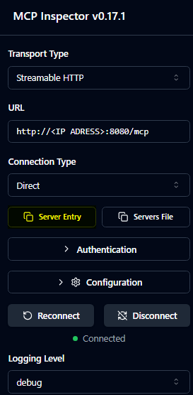
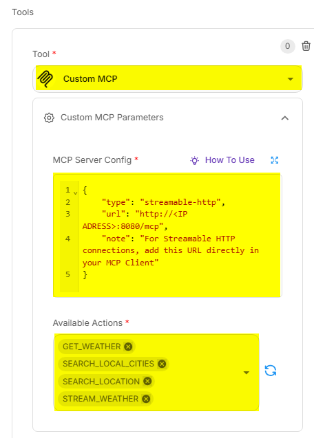

# MCP Weather Server

A streamable HTTP MCP (Model Context Protocol) server for getting weather data via the Open-Meteo API.

## 🚀 Features

- **Streamable HTTP Transport**: Compatible with MCP 2025-03-26 specification
- **Session Management**: Support for persistent sessions with unique IDs
- **Weather Tools**: Three main tools for geolocation and weather data
- **REST API**: Health endpoint for monitoring
- **Kubernetes Ready**: Docker containerization and K8s deployment manifests
- **Local City Search**: CSV-based local city database for offline search

## 📁 Project Structure

```
├── src/                           # Source code TypeScript
├── build/                         # Compiled JavaScript
├── static/                        # CSV city data files
├── test/                          # Test scripts and examples
│   ├── test-k8s-deployment.sh     # Kubernetes deployment tests
│   ├── test_mcp.js               # MCP functionality tests
│   ├── example-client.js         # Example MCP client
│   └── README.md                 # Test documentation
├── claude-configuration/          # Claude Desktop configuration
│   ├── claude_config*.json       # Various Claude configs
│   ├── install_claude_config.sh  # Auto-installation script
│   └── README.md                 # Configuration guide
├── k8s/                          # Kubernetes manifests
│   ├── deployment.yaml           # K8s deployment
│   ├── service.yaml              # K8s service
│   └── ingress.yaml              # K8s ingress
├── Dockerfile                    # Multi-stage Docker build
├── k8s-all-in-one.yaml          # Complete K8s deployment
├── build-deploy-container.sh                     # Automated deployment script
└── KUBERNETES_DEPLOYMENT.md     # Kubernetes deployment guide
```

## 📦 Installation

```bash
# Clone and install dependencies
npm install

# Compile TypeScript
npm run build

# Start the server
npm start
```

## 🔧 Configuration

The server uses the following environment variables:

- `PORT`: Listening port (default: 3000)

Example:
```bash
PORT=8080 npm start
```

## 🛠️ Available MCP Tools

### 1. `search_location`

Search for GPS coordinates of a city or location by name using the Open-Meteo geocoding API.

**Parameters:**

- `city_name` (string): Name of the city or location to search for
- `country` (string, optional): Country name to narrow the search
- `limit` (number, optional): Maximum number of results to return (default: 5, max: 10)

**Example response:**
```json
{
  "query": "Paris",
  "country_filter": null,
  "total_results": 5,
  "locations": [
    {
      "name": "Paris",
      "country": "France",
      "admin1": "Île-de-France",
      "latitude": 48.8566,
      "longitude": 2.3522,
      "timezone": "Europe/Paris",
      "population": 2161000,
      "elevation": 42
    },
    {
      "name": "Paris",
      "country": "United States",
      "admin1": "Texas",
      "latitude": 33.6609,
      "longitude": -95.5555,
      "timezone": "America/Chicago",
      "population": 25171,
      "elevation": 177
    }
  ]
}
```

### 2. `search_local_cities`

Search for cities in the local CSV database for offline functionality and faster local search.

**Parameters:**

- `city_name` (string): Name of the city to search for (case insensitive partial match)
- `exact_match` (boolean, optional): Whether to search for exact match or partial match (default: false)
- `limit` (number, optional): Maximum number of results to return (default: 10, max: 50)

**Example response:**
```json
{
  "query": "Paris",
  "exact_match": false,
  "total_found": 3,
  "results_returned": 3,
  "cities": [
    {
      "name": "Paris",
      "latitude": 48.8566,
      "longitude": 2.3522
    },
    {
      "name": "Paris-15e-Arrondissement",
      "latitude": 48.8421,
      "longitude": 2.3008
    },
    {
      "name": "Parisot",
      "latitude": 44.0625,
      "longitude": 1.7125
    }
  ]
}
```

### 3. `get_weather`

Get current weather information for a location.

**Parameters:**

- `latitude` (number): Latitude in decimal degrees (-90 to 90)
- `longitude` (number): Longitude in decimal degrees (-180 to 180)  
- `location_name` (string, optional): Optional location name for display

**Example response:**
```json
{
  "location": "Paris",
  "weather": {
    "current_weather": {
      "temperature": 15.2,
      "windspeed": 10.5,
      "winddirection": 230,
      "weathercode": 1,
      "is_day": 1,
      "time": "2024-01-15T14:00"
    },
    "current_units": {
      "temperature": "°C",
      "windspeed": "km/h",
      "winddirection": "°",
      "weathercode": "wmo code",
      "is_day": "",
      "time": "iso8601"
    }
  },
  "lastUpdate": "2024-01-15T14:05:30.123Z"
}
```

### 4. `stream_weather`

Start streaming weather data with periodic updates.

**Parameters:**

- `latitude` (number): Latitude in decimal degrees (-90 to 90)
- `longitude` (number): Longitude in decimal degrees (-180 to 180)
- `location_name` (string, optional): Optional location name for display
- `interval_seconds` (number, default: 60): Update interval in seconds

## 🌐 HTTP Endpoints

### Server Health

```http
GET /health
```

Returns server status:
```json
{
  "status": "OK",
  "timestamp": "2024-01-15T14:05:30.123Z"
}
```

### MCP Endpoint

```http
POST /mcp
GET /mcp  
DELETE /mcp
```

Main endpoint for MCP communications. Supports:
- `POST`: Initialization and request sending
- `GET`: SSE stream establishment for responses
- `DELETE`: Session termination

## 📋 Usage Example with MCP Client

### 1. Session Initialization

```javascript
const initRequest = {
  jsonrpc: '2.0',
  id: 1,
  method: 'initialize',
  params: {
    protocolVersion: '2024-11-05',
    capabilities: { tools: {} },
    clientInfo: { name: 'weather-client', version: '1.0.0' }
  }
};

const response = await fetch('http://localhost:8080/mcp', {
  method: 'POST',
  headers: {
    'Content-Type': 'application/json',
    'Accept': 'application/json, text/event-stream'
  },
  body: JSON.stringify(initRequest)
});

const sessionId = response.headers.get('mcp-session-id');
```

### 2. List Available Tools

```javascript
const listToolsRequest = {
  jsonrpc: '2.0',
  id: 2,
  method: 'tools/list',
  params: {}
};

const response = await fetch('http://localhost:8080/mcp', {
  method: 'POST',
  headers: {
    'Content-Type': 'application/json',
    'Accept': 'application/json, text/event-stream',
    'mcp-session-id': sessionId
  },
  body: JSON.stringify(listToolsRequest)
});
```

### 3. Call Weather Tool

```javascript
const weatherRequest = {
  jsonrpc: '2.0',
  id: 3,
  method: 'tools/call',
  params: {
    name: 'get_weather',
    arguments: {
      latitude: 48.8566,
      longitude: 2.3522,
      location_name: 'Paris'
    }
  }
};

const response = await fetch('http://localhost:8080/mcp', {
  method: 'POST',
  headers: {
    'Content-Type': 'application/json',
    'Accept': 'application/json, text/event-stream',
    'mcp-session-id': sessionId
  },
  body: JSON.stringify(weatherRequest)
});
```

## 🧪 Testing

### Quick Testing
```bash
# Start the server
PORT=8080 npm start

# Test the health endpoint
curl http://localhost:8080/health
```

### Comprehensive Testing
The project includes various test scripts organized in the `test/` directory:

```bash
# Run MCP functionality tests
cd test && node test_mcp.js

# Test local city search
cd test && node test_local_cities.js

# Test location search
cd test && node test_search_location.js

# Test Kubernetes deployment (requires K8s cluster)
./test/test-k8s-deployment.sh
```

For more testing options, see [test/README.md](test/README.md).

## 🐳 Container Build & Kubernetes Deployment

This section describes how to containerize the MCP Weather Sample application and deploy it to a Kubernetes cluster.

### 📦 Containerization Overview

The application uses a **multi-stage Docker build** approach for optimal production deployment:

1. **Build Stage**: Compiles TypeScript source code
2. **Production Stage**: Creates minimal runtime image with only production dependencies
3. **Security**: Runs as non-root user with minimal privileges
4. **Health Checks**: Built-in container health monitoring

### 🏗️ Docker Build Process

#### Automated Build & Deployment
```bash
# Complete build and deployment pipeline
./build-deploy-container.sh all

# Individual steps
./build-deploy-container.sh build    # Build Docker image only
./build-deploy-container.sh deploy   # Deploy to Kubernetes only
./build-deploy-container.sh cleanup  # Remove deployment
```

#### Manual Docker Operations
```bash
# Build the Docker image
docker build -t mcp-weather-sample:latest .

# Run container locally for testing
docker run -p 8080:8080 mcp-weather-sample:latest

# Check container health
curl http://localhost:8080/health

# View container logs
docker logs <container-id>
```

#### Docker Image Details
- **Base Image**: `node:20-alpine` (lightweight Linux distribution)
- **Final Size**: ~150MB (optimized with multi-stage build)
- **Port**: 8080 (configurable via `PORT` environment variable)
- **Health Check**: Built-in HTTP health endpoint monitoring
- **User**: Non-root user (`nextjs:nodejs`) for security

### ⚓ Kubernetes Deployment Architecture

#### Deployment Components
The Kubernetes deployment includes:

- **Deployment**: 3 replicas with rolling updates
- **Service**: ClusterIP service exposing port 80→8080
- **ConfigMap**: Environment configuration management
- **Ingress**: External traffic routing with CORS support
- **Health Probes**: Startup, liveness, and readiness checks

#### Resource Configuration
```yaml
resources:
  requests:
    memory: "128Mi"    # Minimum memory allocation
    cpu: "100m"        # Minimum CPU allocation (0.1 core)
  limits:
    memory: "512Mi"    # Maximum memory limit
    cpu: "500m"        # Maximum CPU limit (0.5 core)
```

#### High Availability Features
- **3 Replicas**: Ensures service availability during pod failures
- **Rolling Updates**: Zero-downtime deployments
- **Health Checks**: Automatic pod restart on failure
- **Resource Limits**: Prevents resource exhaustion
- **CORS Configuration**: Proper header handling for MCP sessions

### 🚀 Deployment Options

#### Option 1: All-in-One Deployment
```bash
# Deploy everything with single command
kubectl apply -f k8s-all-in-one.yaml

# Monitor deployment progress
kubectl rollout status deployment/mcp-weather-app

# Check pod status
kubectl get pods -l app=mcp-weather-app
```

#### Option 2: Component-by-Component
```bash
# Deploy individual components
kubectl apply -f k8s/configmap.yaml
kubectl apply -f k8s/deployment.yaml
kubectl apply -f k8s/service.yaml
kubectl apply -f k8s/ingress.yaml
```

#### Option 3: Automated Script
```bash
# Use the provided deployment script
./build-deploy-container.sh all

# Script features:
# - Validates kubectl connectivity
# - Builds Docker image
# - Applies Kubernetes manifests
# - Waits for deployment readiness
# - Provides access instructions
```

### 🔧 Configuration Management

#### Environment Variables
Configure the application through the ConfigMap:
```yaml
apiVersion: v1
kind: ConfigMap
metadata:
  name: mcp-weather-config
data:
  NODE_ENV: "production"
  PORT: "8080"
  LOG_LEVEL: "info"
```

#### Ingress Configuration
```yaml
# Custom domain configuration
spec:
  rules:
  - host: mcp-weather.your-domain.com  # Replace with your domain
    http:
      paths:
      - path: /
        pathType: Prefix
        backend:
          service:
            name: mcp-weather-service
            port:
              number: 80
```

### 🧪 Testing Deployment

#### Quick Validation
```bash
# Test deployment health
./test/test-k8s-deployment.sh

# Manual health check via port-forward
kubectl port-forward service/mcp-weather-service 8080:8080
curl http://localhost:8080/health

# Debug
kubectl exec -it pods/$(kubectl get pods  --no-headers -o custom-columns=":metadata.name" | grep 'flowise'|head -1) sh


```

#### Comprehensive Testing
```bash
# Test all endpoints and functionality
./test/test-k8s-deployment.sh local

# Test via ingress (requires domain configuration)
./test/test-k8s-deployment.sh ingress your-domain.com
```

### 📊 Monitoring & Troubleshooting

#### Checking Deployment Status
```bash
# Pod status and logs
kubectl get pods -l app=mcp-weather-app
kubectl logs -l app=mcp-weather-app -f

# Service endpoints
kubectl get endpoints mcp-weather-service
kubectl describe service mcp-weather-service

# Ingress status
kubectl get ingress mcp-weather-ingress
kubectl describe ingress mcp-weather-ingress
```

#### Common Troubleshooting
```bash
# Pod not starting
kubectl describe pod <pod-name>
kubectl logs <pod-name> --previous

# Service not accessible
kubectl port-forward service/mcp-weather-service 8080:80
curl http://localhost:8080/health

# Image pull issues
kubectl describe pod <pod-name> | grep -A 5 "Events:"
```

### 🔄 Scaling & Updates

#### Horizontal Scaling
```bash
# Scale to 5 replicas
kubectl scale deployment mcp-weather-app --replicas=5

# Verify scaling
kubectl get pods -l app=mcp-weather-app
```

#### Rolling Updates
```bash
# Update image version
kubectl set image deployment/mcp-weather-app \
  mcp-weather-app=mcp-weather-sample:v2.0.0

# Monitor rollout
kubectl rollout status deployment/mcp-weather-app

# Rollback if needed
kubectl rollout undo deployment/mcp-weather-app
```

For complete deployment instructions and advanced configurations, see [KUBERNETES_DEPLOYMENT.md](KUBERNETES_DEPLOYMENT.md).

## ⚙️ Claude Desktop Integration

The project includes pre-configured Claude Desktop configurations in the `claude-configuration/` directory:

```bash
# Auto-install Claude configuration
cd claude-configuration && ./install_claude_config.sh

# Validate HTTP configuration
cd claude-configuration && ./validate_claude_http.sh
```

Available configurations:
- **Basic**: `claude_config.json` - Minimal setup
- **Detailed**: `claude_config_detailed.json` - Full options
- **HTTP**: `claude_config_http.json` - HTTP transport specific

For detailed setup instructions, see [claude-configuration/README.md](claude-configuration/README.md).

## 🔍 Using MCP Inspector

You can use the official MCP Inspector to visually explore and test your weather server tools in a user-friendly interface.

### Installation and Setup

1. **Install MCP Inspector** (requires Node.js):

   ```bash
   npx @modelcontextprotocol/inspector
   ```

2. **Start your weather server**:

   ```bash
   PORT=8080 npm start
   ```

3. **Configure MCP Inspector**:
   - Server URL: `http://localhost:8080/mcp`
   - Transport: `HTTP (Streamable)`
   - Protocol Version: `2024-11-05`

### Visual Interface Features



The MCP Inspector provides:

- **🛠️ Tools Explorer**: Browse all available tools (`search_location`, `get_weather`, `stream_weather`)
- **📝 Interactive Forms**: Easy-to-use forms for entering tool parameters
- **🎯 Real-time Testing**: Execute tools and see live responses
- **📊 Response Viewer**: JSON-formatted results with syntax highlighting
- **🔄 Session Management**: Visual session state and connection status
- **📈 Request/Response History**: Track all your API interactions

### Example Workflow

1. **Connect** to your server using the Inspector
2. **Explore** the three available weather tools
3. **Test location search**:
   - Tool: `search_location`
   - Parameters: `city_name: "Paris"`
4. **Get weather data**:
   - Tool: `get_weather`
   - Parameters: Use coordinates from previous search
5. **Monitor streaming**:
   - Tool: `stream_weather`
   - Watch real-time weather updates

### Benefits

- **No coding required**: Test your MCP server without writing client code
- **Visual debugging**: See exactly what data flows between client and server
- **Tool validation**: Verify parameter schemas and response formats
- **Rapid prototyping**: Quickly iterate on your MCP server implementation

The Inspector is particularly useful during development to ensure your weather server works correctly before integrating it into larger applications.

## 🏗️ Architecture

- **Express.js**: HTTP server
- **MCP SDK**: MCP protocol implementation with StreamableHTTPServerTransport
- **Open-Meteo API**: Weather data source
- **TypeScript**: Development language with compilation to JavaScript


## Integrate MCP server on flowise (lowcode GenAI tool)

1) On flowise initialise an agentflow



2) Retrieve MCP configuration through MCP inspector

Copy/Paste form "Server Entry" on Inspector interface 

 
3) Configure a "MCP Custom" tool and add exposed toolexposed by the MCP server on flowise
add MCP configuration specifciation copied from Inspector


 
## 📄 Specifications

- **MCP Protocol**: Version 2024-11-05 and 2025-03-26
- **Transport**: Streamable HTTP with SSE support
- **Data Format**: JSON-RPC 2.0
- **Weather API**: [Open-Meteo](https://open-meteo.com/)

## 🔗 Useful Links

- [Model Context Protocol](https://modelcontextprotocol.io/)
- [Open-Meteo API](https://open-meteo.com/en/docs)
- [MCP TypeScript SDK](https://github.com/modelcontextprotocol/typescript-sdk)

## 📝 License

This project is a demonstration example based on open-meteo-mcp.
